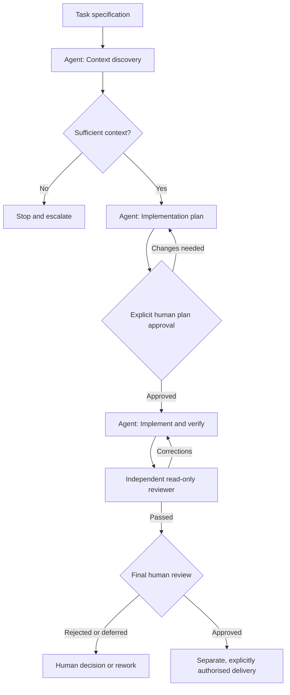
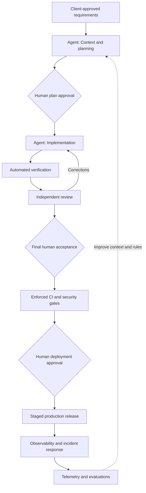

# Smart Office Challenge — Agentic SDLC Proposal Brief

**For:** ZRS Camp 2026 proposal team  
**Focus:** Agentic SDLC design, application, demonstrable evidence and evolution to full delivery  
**Evidence snapshot:** 25 September 2026, from the independent Claude repository audit shared by the team  
**Status:** Working briefing, not a final submission or a record of all completed Camp work

> **Core message:** We have designed a task-scoped Agentic SDLC with bounded agent responsibilities, explicit human decision gates and independent review. Initial delivery has produced working code and reproducible automated tests. The most important remaining SDLC task is to demonstrate one *actual*, evidence-backed execution from context discovery through review and human acceptance—not merely show that the workflow is documented.

## 1. Assessment: Is the material sufficient for the bid?

**Yes—as source material for the SDLC part of the bid. Not yet as final proof for the jury.** The process design, engineering roles and full-delivery direction are substantial. What needs improvement is the link between the documented process and records proving that its individual controls operated on a real task.

| Area | Assessment | What the team should do |
|---|---|---|
| Workflow design | Clear, task-scoped lifecycle with explicit stop conditions and gates | Retain; simplify visually for the slide |
| Agent versus human responsibilities | Roles and boundaries are well defined | Explain decisions each role can and cannot make |
| Engineering output | Real task-scoped commits and passing tests | Use as outcome evidence, not proof of every intermediate gate |
| Actual lifecycle evidence | Context, approval and review records are largely absent from the repository | Retrieve an authentic full execution trace for one completed task |
| Full-delivery evolution | Credible approach identified, but mostly proposed rather than implemented | Show the specific additions: persistence, enforcement and operations |

The independent audit assigned **12/25 for Agentic SDLC** using its *own diagnostic rubric*, not the competition jury's official sub-scoring methodology. This score reflects missing accessible process evidence as well as missing full-delivery documentation; it is not proof that the team skipped approval or review in Claude conversations.

## 2. Early delivery snapshot and what it does—and does not—mean

As observed by the independent audit on **25 September 2026**:

- **8 of 15 planned tasks had completion commits:** TASK-01 through TASK-07 plus TASK-15, completed out of sequence.
- TASK-08 (Check-in Gateway) was **actively being implemented** while the audit ran; the observed files were uncommitted, unwired and untested at that moment. Its final status must be rechecked before the slides are submitted.
- An independent rerun reported **68/68 automated tests passing across 11 test files**, with lint and TypeScript checks also passing.
- Booking concurrency was tested against **real PostgreSQL and real HTTP requests**, with **25 iterations of each of two race-test cases**. This validates a significant implementation result.

**Interpretation:** The team started implementation on 24 September and already demonstrated an initial rhythm of small, scoped engineering changes by the audit snapshot. The task count and passing tests are useful evidence of progress. They are **not** evidence of per-task speedups, cost reductions or the execution of every Agentic SDLC gate.

Do **not** turn “8/15 tasks completed” into a percentage of total engineering effort: tasks differ substantially in size, and the release engine and notification outbox were still outstanding in the audit. No reliable per-task active time, waiting-time, review-loop or AI-cost series was supplied. If the original Claude sessions expose those measurements, report them with the collection method and coverage; otherwise omit claims about measured productivity gains.

**Update required:** Refresh task statuses and the test count immediately before submission. All figures above are a dated snapshot, not final Camp results.

## 3. Actual Agentic SDLC: the process to explain

The repository defines a single-task entry point (`/work TASK-XX`) and a sequence of task resolution, context discovery, planning, explicit approval, implementation and verification, isolated independent review, and final human disposition. The sequence is well specified **in configuration and documentation**. Execution of all intermediate steps for past tasks was **not independently verifiable** from saved repository artifacts.

| Stage | Agent responsibility | Human responsibility | Evidence status at audit |
|---|---|---|---|
| Resolve task and discover context | Locate one task; gather bounded requirements, HLD and project rules; stop on missing or contradictory context | Supply clarification when escalated | Configured; normalized per-task context output not persisted |
| Prepare implementation plan | Produce a plan constrained by the task and acceptance criteria | Explicitly approve or reject before implementation | Configured; per-task plans and approval records not persisted |
| Implement and verify | Produce scoped changes and execute relevant tests/checks | Resolve escalated decisions; do not silently accept scope changes | Output partially verified through commits, implementation and rerun tests |
| Independent review | Fresh, read-only reviewer examines the change and checks evidence; request corrections when needed | Resolve escalation or trade-offs | Reviewer defined; actual per-task review reports not persisted |
| Final human review | Assemble evidence and report status | Explicitly approve, reject or defer | Required by workflow; historical decisions not independently verified |
| Separate delivery action | Does not automatically commit/push/deploy | Give separate explicit delivery instruction | Git commits exist; authorship alone does not prove that all prior gates occurred |

**Important distinction for presenting this diagram:** Label a step as *verified* only if actual execution evidence exists. A workflow rule or agent definition establishes design, not the past execution of that rule.

### Suggested slide diagram — documented lifecycle

For the **actual Camp** slide, annotate the diagram or use a small legend: *documented/configured*, *observed implementation output*, *verified test result*, and *human action confirmed by original session evidence*. Do not imply that this entire path was executed and recorded for all completed tasks.

## 4. Agent responsibilities: the differentiator

| Role | Meaningful responsibility | Boundary | Available evidence |
|---|---|---|---|
| **PoC planner** | Convert the approved PoC design into bounded, dependency-aware task specifications | Cannot independently rewrite approved product and architecture decisions | 15 structured task files exist; the audit found them traceable to HLD requirements |
| **`/work` orchestrator** | Resolve one task and coordinate context, plan, execution and review gates | Must not infer approval or chain delivery actions without permission | Rules and workflow definitions exist; original invocation logs not saved in repository |
| **Implementer** | Deliver the approved change within scope and execute checks | Cannot declare passing verification when checks fail or are unavailable | Scoped commits, implemented code and independently passing tests |
| **Independent reviewer** | Fresh-context, read-only examination of changes and verification evidence | Cannot fix the code or grant human acceptance | Dedicated agent configuration exists; actual prior review outputs not saved |
| **Human decision-maker** | Approve plans, resolve ambiguity, accept/reject final work and authorise delivery | Retains accountability; approval must be explicit | Policy clearly defined; historical decisions still need original session evidence |

The separation of **implementer** and **independent reviewer** is an especially useful design point. Explain why it exists—reducing self-review and independently checking evidence—but present it as *demonstrated in practice* only once an authentic reviewer report has been recovered or generated during a newly observed task.

## 5. The concrete task example currently available

### TASK-07: Two simulated check-in adapters

The audit identified TASK-07 as a suitable **engineering-output case study**:

1. **Requirement:** Deliver two independent simulated adapters against a common canonical check-in event contract, supporting the goal of vendor-neutral integration.
2. **Bounded implementation:** An app/QR adapter and a test-harness adapter were committed; their changes matched the task specification without unrelated scope changes.
3. **Verification:** Both adapters passed isolated contract tests when the audit reran the tests.
4. **Current limitation:** The repository does not retain this task's original context-discovery output, agent implementation plan, explicit human approval, reviewer report or final human disposition.

**Use this example to show:** requirement-to-task-to-code traceability, limited implementation scope and independently reproducible checks.

**Do not use it alone to claim:** that every lifecycle gate actually ran. If the original TASK-07 Claude session is still available, preserve the genuine intermediate records. Otherwise, select the next task for which a complete, authentic end-to-end trace can be collected.

### What one complete demonstration should contain

- Original task and acceptance criteria.
- Context-discovery result, including any missing-context decision.
- Implementation plan.
- Original explicit human decision on the plan.
- Resulting implementation diff and relevant verification command/output.
- Actual independent reviewer report, including findings or corrections if any.
- Original final human disposition.
- Clear link between those artefacts and the same task.

An honest *retrospective confirmation* is acceptable as a retrospective note, but must not be labelled as an approval issued before implementation if the team cannot show that happened.

## 6. Highest-priority gaps for the SDLC owner

The following priorities are specific to the **SDLC presentation and evidence**. They are separate from the engineering team's remaining feature-delivery tasks.

| Priority | Gap | Smallest valuable action | Proof generated |
|---|---|---|---|
| **P0** | No complete task-level execution trace | Recover session evidence for one finished task, or preserve the next task's actual execution | One end-to-end case study |
| **P0** | Human plan approval and final disposition are not independently evidenced | Extract the original approval/disposition messages where available; clearly mark retrospective confirmations | Auditable human decision trail |
| **P1** | Independent-review execution not evidenced | Save the actual reviewer output for a task, including findings/rework if applicable | Distinct reviewer artefact |
| **P1** | No trustworthy execution telemetry series yet | Collect original per-task active times, interventions and review loops only where genuinely available | Dated, coverage-labelled operational metrics |
| **P1** | Full-delivery evolution insufficiently concrete | Show the exact changes needed to operationalise the current workflow | Credible target lifecycle diagram |

**Avoid adding more agent roles solely for the presentation.** The immediate issue is showing that the current lifecycle works in practice, not increasing the theoretical sophistication of the framework.

## 7. The target Agentic SDLC for full delivery

Keep the current structure and explain **three purposeful extensions**:

### 1. Persistence

Plans, meaningful context findings, human decisions, verification outputs and independent-review dispositions become durable records linked to tasks or pull requests. A complete evidence trail should not depend on whether an old Claude conversation is still accessible.

### 2. Enforcement

CI executes required build, lint, type, test and appropriate security checks. Relevant evidence and approval requirements become enforceable merge conditions. Additional security and privacy reviews are applied according to risk; agents do not bypass decision ownership.

### 3. Operations and feedback

Extend the lifecycle to staged deployment, explicit human release approval, monitoring, incident handling, maintenance and a feedback loop. Capture recurring context problems, verification failures and review findings and use them to improve documentation, project rules and agent evaluation cases. These are **target-state proposals**, not features already demonstrated in the Camp repository.

**Client-facing rationale:** We would not replace the Camp workflow with a dramatically larger framework. We would make its essential controls durable and enforceable, then extend accountability across deployment, operations and maintenance.

## 8. Recommended content for the presentation team

### Slide 6 — Actual Agentic SDLC and PoC learning

**Suggested headline:** *Task-scoped agentic delivery with independent review and explicit human decision gates.*

**Primary visual (roughly 70% of space):** Compact actual-lifecycle diagram and one real task example. Clearly mark which gates are observed versus only defined. **Secondary panel (roughly 30%):** Latest verified engineering-result snapshot and one genuine learning from the audit.

**Current evidence that may be used, with the date:**

- Eight completion commits existed at the audit snapshot.
- Sixty-eight of sixty-eight tests passed when independently rerun.
- Booking concurrency tests exercised a real database and real HTTP requests.
- TASK-07 illustrates scoped implementation and traceable contract tests.

**Learning:** The lifecycle definitions are strong, but intermediate evidence is lost when it remains solely in agent conversations. This motivates persistent, linked decision and review records.

**Speaker note:** A strong process description is not sufficient on its own. Show an authentic task-level trace of agent output, human decisions and independent verification before claiming that the entire pipeline operated end-to-end.

### Slide 7 — Target Agentic SDLC for full delivery

**Suggested headline:** *Scale the existing workflow through persistence, enforcement and operations.*

**Primary visual (roughly 60%):** The Camp lifecycle as a foundation, with proposed production controls differentiated visually. **Secondary panel (roughly 40%):** Persistence of decisions and reviews; automated CI/PR enforcement; security and privacy checks; deployment and operating controls; telemetry/evaluation feedback.

**Speaker note:** Clearly identify *what exists today* versus *what the full-delivery programme would add*. The improvement story is about making responsible agentic work repeatable and auditable, not about maximising the number of agents.

### Claims to avoid until evidence is available

- “Every completed task passed the entire agentic lifecycle with recorded approval and review.”
- “The independent reviewer ran and passed for all completed tasks.”
- “Our AI workflow delivered a measured X-times speedup or Y% cost reduction.”
- “CI, staged deployments, observability and automated feedback evals are already implemented.”
- Any test count, task count or completion claim presented as current without a fresh check.

## 9. Bottom line

**The SDLC material is sufficiently strong for the proposal team to build its slides now.** The critical improvement before final submission is not another long description of the workflow: it is a short, genuine execution story showing how one bounded task passed through actual agent work, verification, independent review and human decision-making. Pair that with the dated engineering results and a realistic evolution from conversational controls to persisted, enforced production controls.

---

### Evidence and source notes

This briefing is grounded in the team's **Independent Audit Report — ZRS Camp 2026 Smart Office Challenge**, dated 25 September 2026, particularly its sections 2–9, 13, 15 and 17. The audit inspected the repository and reports independently rerunning tests, lint, migration and type checks. This document does **not** constitute a fresh review of the live repository, and its findings must be updated for work completed after the audit snapshot.

Relevant paths referenced by that audit include:

- `agentic-workflow/` and `.claude/skills/work/SKILL.md` — documented lifecycle and entry point.
- `.claude/agents/independent-reviewer.md` and `.claude/agents/poc-planner.md` — agent role definitions.
- `planning/tasks/` — bounded task specifications.
- `planning/tasks/TASK-15-verification-evidence.md` — the one persisted verification document the audit identified.
- `test/integration/booking-concurrency/booking-concurrency.test.ts` — real-database concurrency validation.
- TASK-07 adapter implementation and contract tests — the selected engineering-output example.

**Evidence convention for slides:** *Verified* = code, original record or rerun test supports the assertion; *Documented* = workflow/design says it should happen; *Not verified* = original execution evidence was not available. Do not collapse these categories.
