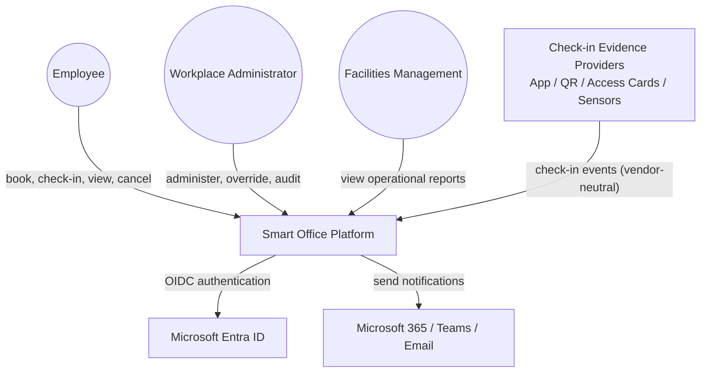
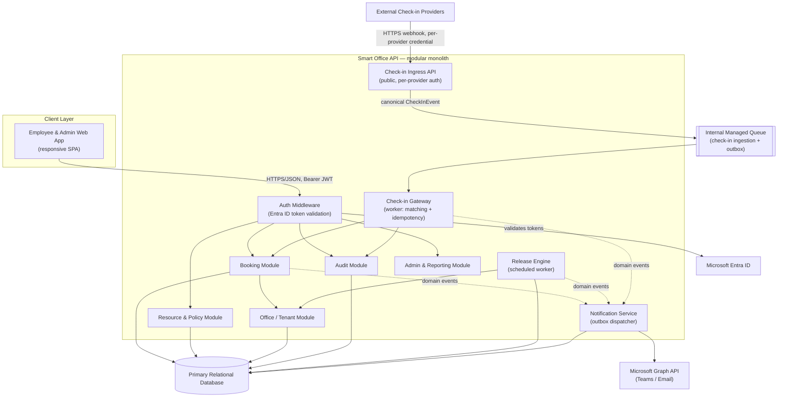
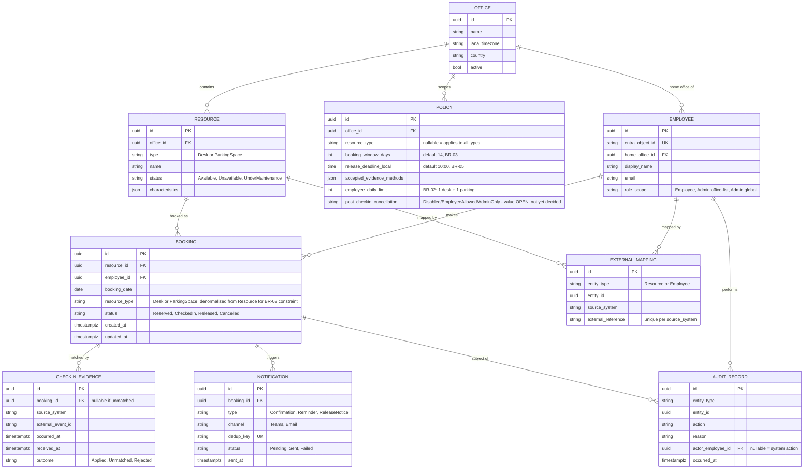
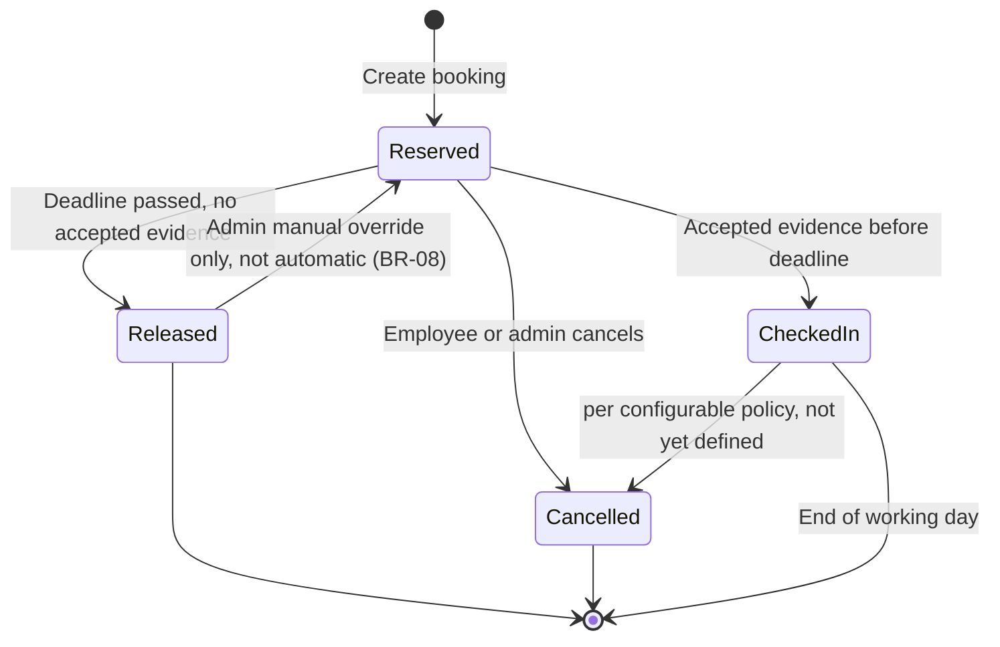
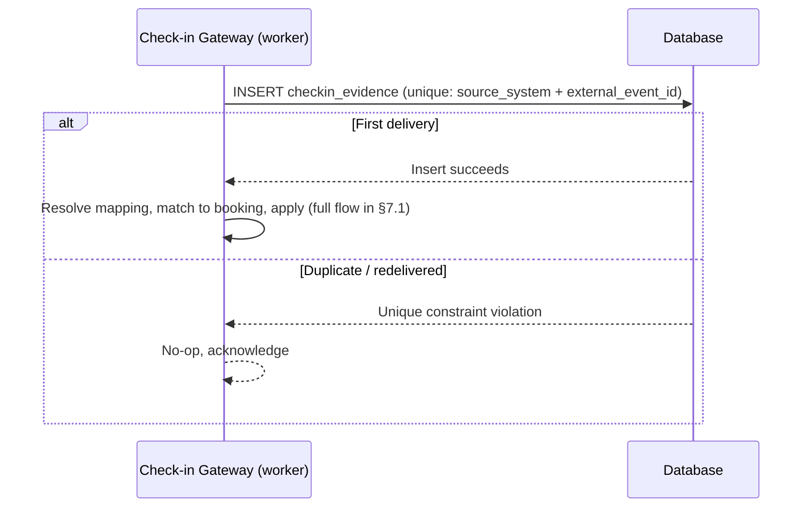
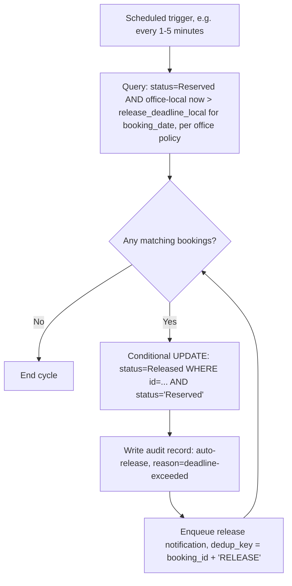
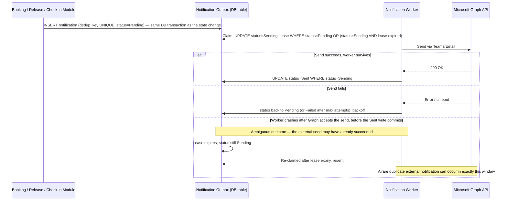
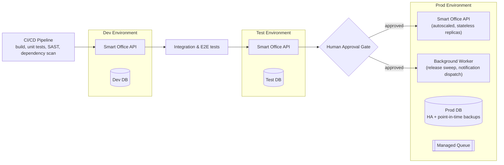

# Smart Office — High-Level Solution Design

Status: **APPROVED — HUMAN REVIEW COMPLETE (Revision 3)**
Scope: The **complete target solution**, not the hackathon PoC. PoC selection is an explicit later stage and is out of scope here.

### Approval note

This HLD was reviewed by a human across two rounds and is now **APPROVED** as the basis for PoC selection. It is no longer a draft; further changes should be tracked as new revisions against this approved baseline, not silent edits. Items flagged **[OPEN]** throughout the document (e.g., N-02, N-05, N-06 in §16, and the Q-01/Q-07/Q-08/Q-09 client inputs) are approved as *known, tracked open items*, not as defects — the architecture is deliberately designed to accommodate their eventual resolution without redesign.

### Revision history

**Revision 3** — corrected a residual overclaim in §5.4: the release sweep's idempotency guarantee was stated as "never double-releases or double-notifies," which overstated what is actually guaranteed and conflicted with §5.5's honest at-least-once notification delivery model. Reworded to "never double-releases or creates duplicate notification intents" — the sweep guarantees exactly one notification *intent* per release event; whether the resulting external message can itself be delivered twice remains governed by §5.5's claim/lease pattern (accepted, documented, non-blocking). No architectural change.

**Revision 2** — response to human review round 1. Addressed six findings; no prior architectural direction was reversed.

| # | Finding | Resolution |
|---|---|---|
| 1 | BR-02 concurrency guarantee unexplained | Added an explicit employee-level partial unique index and flow, alongside the existing resource-level one (§5.2) |
| 2 | Notification dedup claimed more than an outbox alone can guarantee | §5.5 and AD-04 rewritten to state at-least-once delivery with a documented, narrow, accepted duplicate-send window — not exactly-once |
| 3 | Scalability wording said "≤5,000 users"; invented a daily transaction volume | Corrected to "at least 5,000 users" throughout; removed the invented volume figure; peak traffic is now explicitly an open input (Q-01) feeding future load-test targets (§12) |
| 4 | Missing HLD-level testing strategy; broken NFR-06 reference | Added §12 Testing Strategy; corrected the NFR-06 coverage row to point at it |
| 5 | External providers appeared to depend directly on an internal queue | §7.1 rewritten around a public Check-in Ingress API boundary, with explicit employee/resource/booking matching via an External Mapping entity |
| 6 | "CheckedIn → Cancelled: admin override only" was an invented policy | Removed from the fixed state machine; modelled as a configurable, currently-undecided `Policy` value (§5.1, §16) |

---

## 0. Document Scope & Input Basis

The only authoritative input available in this repository is [`context/smart-office-context.md`](../context/smart-office-context.md) — the approved Context Discovery document. No separate "original specification" file exists in the repository; the Context Discovery document itself states it is derived from the original specification and is marked **"Sufficient for High-Level Solution Design: YES"** with **no blocking questions**. This HLD treats that document as the single source of truth for requirements and traces every design decision back to it.

Throughout this document, statements are tagged so requirements are never confused with design choices:

| Tag | Meaning |
|---|---|
| **[REQ]** | Explicit requirement from the Context Discovery document (FR/BR/NFR/C/business need) |
| **[ASSUMPTION — client]** | An assumption already recorded in the Context Discovery document (A-01..A-07) |
| **[ASSUMPTION — new]** | A new assumption introduced in this HLD because the context doc is silent; flagged for confirmation |
| **[DECISION]** | An architectural decision made in this document |
| **[OPEN]** | An unresolved question — not invented, not silently defaulted |

No client requirement is invented in this document. Where the context doc left a question open (Section 13 of the context doc), this HLD either (a) designs the architecture to remain neutral to the eventual answer, or (b) proposes a default explicitly marked as provisional and pending confirmation.

---

## 1. Architecture Goals

1. Satisfy all 19 functional requirements, 9 business rules and 14 non-functional requirements in the Context Discovery document for the **full solution**, while allowing a 2–3 feature PoC to be carved out later without contradicting this design. **[REQ]**
2. Guarantee correctness of the two highest-risk mechanics: booking conflict prevention (R-01) and idempotent, order-tolerant check-in/release processing (R-02, R-03, R-04, R-05). **[REQ]**
3. Support growth from one Serbian office (~200 employees, 150 desks, 30 parking spaces) to multiple offices, local policies, local time zones, and at least 5,000 users — **without a platform redesign**. **[REQ — FR-16, NFR-04, P-07]**
4. Keep the architecture as simple as the requirements allow. Distributed-systems complexity (microservices, event streaming, multi-region active-active, NoSQL) is only introduced if a specific requirement demands it. **[DECISION — see §14]**
5. Enforce security, privacy, auditability, and human accountability for production changes as first-class architecture concerns, not afterthoughts, given the Agentic SDLC delivery model. **[REQ — NFR-01/02/12/13, C-05/06/07]**
6. Keep every business rule (BR-01..BR-09) as a server-side, testable invariant rather than UI-enforced behaviour.

---

## 2. Proposed Solution Overview

**[DECISION]** Smart Office is built as a **modular monolith**: a single deployable API application internally decomposed into clearly bounded modules (Booking, Resource & Policy, Check-in Gateway, Release Engine, Notification, Audit, Office/Tenant, Admin & Reporting), backed by **one relational database** as the single source of truth, plus a lightweight background worker and a managed queue for asynchronous, retryable work (check-in ingestion, notification dispatch, scheduled release sweeps).

**Why this shape, not microservices:** the requirement is a floor of **at least 5,000 users** (NFR-04), not a ceiling, and the client has not supplied concrete daily or peak transaction volumes — this HLD does not assume any (**[OPEN] Q-01**). What *is* structurally bounded by the business rules, independent of total user count, is per-employee load: BR-01/BR-02 mean each employee can hold at most one active desk booking and one active parking booking per day, so the write workload per employee is inherently small and does not compound with scale the way, e.g., a social feed would. A single well-indexed relational database gives conflict prevention "for free" via ACID transactions and unique constraints, which is materially harder to get right in a distributed/microservices design (would require distributed locks or a saga pattern). Splitting into services now would add operational cost (multiple deployables, service discovery, distributed tracing, network failure modes) without a requirement — or a measured load — that justifies it. The module boundaries below are deliberately drawn so that any module could be extracted into its own service later **if** growth or measured load ever demands it — this satisfies "future growth without redesign" (P-07) without paying the distributed-systems tax today. Concrete throughput and peak-concurrency numbers remain an open input (Q-01) that should drive load-test targets once available — see §12 (Testing Strategy) and §16.



**[DECISION — target cloud]** Microsoft Azure is proposed as the target cloud, because Entra ID and Microsoft Graph (Teams/Email) are **required** integrations **[REQ — FR-17, FR-18]** and Azure gives first-party, low-friction integration with both (native OIDC trust, Graph SDKs, managed identity instead of stored secrets). The Context Discovery document explicitly leaves cloud provider unspecified (A-07) and delegates the choice to solution design — this is that choice, not an invented requirement. **Alternatives and trade-offs are recorded in §13 (AD-06).** This decision should be explicitly confirmed by a human reviewer/client stakeholder before implementation, since it has cost and vendor implications beyond pure architecture.

---

## 3. Component Architecture



### Component responsibilities and boundaries

| Module | Owns | Does not do |
|---|---|---|
| **Auth Middleware** | Validating Entra ID JWTs, resolving the local Employee/Principal record, attaching role/office scope to the request context | Business rules, data access beyond identity resolution |
| **Booking Module** | Availability search, booking creation/cancellation, conflict prevention (resource- and employee-level), booking-limit enforcement | Notification delivery, check-in transport, policy definition |
| **Resource & Policy Module** | Resource CRUD, resource state (Available/Unavailable/Under Maintenance), policy configuration (booking window, limits, deadlines, accepted evidence), external resource/employee mapping administration | Booking transactions |
| **Check-in Ingress API** | Public-facing per-provider authentication, provider payload validation, translation to the canonical `CheckInEvent`, enqueueing (§7.1) | Matching evidence to a booking, internal processing, employee sign-in (never uses Entra ID) |
| **Check-in Gateway (worker)** | Idempotent consumption from the internal queue, resolving external mappings, matching evidence to a booking | Public-facing authentication or vendor payload parsing (owned by the Ingress API) |
| **Release Engine** | Scheduled evaluation of deadlines, releasing unconfirmed bookings, timezone-aware deadline computation | Notification delivery (only raises the event) |
| **Notification Service** | Outbox-driven, deduplicated dispatch to Teams/Email via Graph API | Deciding *when* a notification is warranted (that's the domain module's job) |
| **Audit Module** | Append-only recording and query of significant actions | Nothing else — deliberately narrow and tamper-resistant |
| **Office / Tenant Module** | Office registry, IANA timezone, per-office scoping | Policy values themselves (owned by Policy) |
| **Admin & Reporting Module** | Operational overview, manual overrides (delegates the actual state change to Booking/Resource modules so every override is still validated and audited) | Bypassing audit or authorization |

**[DECISION]** Each module owns its own tables (naming convention / schema grouping) and other modules access its data only through its internal service interface, never by querying another module's tables directly — a "modular monolith with enforced module boundaries." This is what allows a future extraction to standalone services (if the user base grows an order of magnitude beyond the current at-least-5,000 floor) without redesigning the domain model. **Why:** cheapest way to buy future optionality without paying today's distributed-systems cost. **Trade-off:** requires discipline in code review to prevent boundary erosion — this is a governance cost, not a runtime one.

---

## 4. Core Domain Model



Notes on modelling choices:

- **[DECISION]** `Resource.type` distinguishes Desk vs. Parking Space with a shared table plus a `characteristics` JSON column for type-specific attributes (e.g., monitor, accessibility, EV charging), rather than separate tables per type. **Why:** FR-01/FR-02/FR-11 treat both resource kinds almost identically (search, book, administer); a shared table with a flexible attribute bag avoids duplicated logic while Q-03 (which characteristics are filterable) remains open — new characteristics can be added without a schema migration.
- **[DECISION]** `Employee` is a **local projection** of the Entra ID identity (subject/object id, display name, email, home office, resolved role scope), populated **just-in-time on first sign-in** (upsert on login) rather than the API trusting client-supplied claims for authorization or requiring a separate HR feed. **Why:** bookings need a stable local foreign key, and role/office scope must be resolved and enforced server-side (R-07), not derived from a claim the client could tamper with. **Trade-off / open question:** this does not solve org-lifecycle propagation (leavers, transfers) — see **[OPEN] Q-11** in §16; JIT provisioning handles new joiners cleanly but a leaver's bookings must be handled by an explicit deactivation process, which is an admin action, not an automatic Entra sync in this HLD.
- **[DECISION]** `role_scope` is a **data-driven** field (`Employee`, `Admin` with an explicit list of office ids, or `Admin:global`) sourced from Entra ID App Roles/Group claims at JIT-provisioning time. **Why:** the context doc leaves "should administrators be global or office-specific" open (**[OPEN] Q-10**). Rather than guessing the business answer, the architecture supports both simultaneously — the answer becomes a configuration/role-assignment decision, not an architecture decision.
- **[DECISION]** `Booking.resource_type` denormalizes `Resource.type` onto the booking row, set once at creation and never updated. **Why:** it exists solely to make the BR-02 employee-level uniqueness constraint expressible as a single-table index (§5.2) — most relational databases cannot enforce a uniqueness constraint atomically across a join.
- **[DECISION]** `EXTERNAL_MAPPING` translates a provider-specific identifier (badge id, sensor id, etc.) to a local `Resource` or `Employee`, keyed uniquely per `(source_system, external_reference)`. **Why:** keeps vendor-specific identifiers out of the core `Resource`/`Employee` tables entirely — adding or retiring a provider is a data change to this table, not a schema change (§7.1).
- **[OPEN]** `Policy.post_checkin_cancellation` exists as a configuration slot but its value is **not decided** — see §5.1 and §16. Its presence in the schema is a decision (the policy must be configurable); its value is explicitly not.
- `Booking.booking_date` is a plain date (no time component) representing the office-local working day, consistent with BR-01 ("bookings are for one working day").

---

## 5. Main System Flows

### 5.1 Booking lifecycle (state machine)



**[OPEN]** Whether an employee can cancel their own booking *after* check-in (as opposed to before) is **not specified** by the client requirements: FR-04 says employees can "view and cancel current and future bookings" without qualifying this by check-in state, and no Business Rule restricts it. Rather than inventing a policy — e.g. defaulting to "admin-only," which was flagged in review as unfounded — this transition is modelled as a **configurable policy value**, `Policy.post_checkin_cancellation` (§4), owned by the Resource & Policy Module and scoped per office/resource type like every other policy. Until a value is chosen, the transition is intentionally undefined rather than defaulted; see §16 for tracking. This is different from `Released → Reserved`, which **is** explicitly constrained by the client (BR-08: "an administrator may resolve the situation," no automatic restoration) — that transition remains admin-only by requirement, not by assumption, and is unaffected by this change.

### 5.2 Concurrent booking — conflict prevention

Two independent concurrency guarantees are required, and both are enforced the same way: as **database constraints evaluated atomically at insert time**, never as an application-level "check, then insert," which would still race under concurrent requests.

1. A single **resource** cannot receive two active bookings for the same day (FR-05, R-01).
2. A single **employee** cannot end up with two active desk bookings, or two active parking bookings, for the same day — even if the two concurrent requests target *different* resources (BR-02).

#### Resource-level conflict prevention

```mermaid
sequenceDiagram
    participant EA as Employee A
    participant EB as Employee B
    participant BM as Booking Module
    participant DB as Database

    EA->>BM: POST /bookings (resource X, date D)
    EB->>BM: POST /bookings (resource X, date D)
    par Concurrent transactions
        BM->>DB: BEGIN; INSERT booking
    and
        BM->>DB: BEGIN; INSERT booking
    end
    DB-->>BM: Insert 1 succeeds (unique constraint satisfied)
    DB-->>BM: Insert 2 rejected (unique constraint violated)
    BM-->>EA: 201 Created, status=Reserved
    BM-->>EB: 409 Conflict, "resource already booked"
```

**[DECISION — R-01, FR-05]** Enforced by a **partial unique index** on `(resource_id, booking_date) WHERE status IN ('Reserved','CheckedIn')`, not by application-level locking or a distributed lock service. **Why:** the database already serializes concurrent writes to the same row/index entry; this is the simplest mechanism that gives a hard guarantee regardless of how many API instances are running. **Alternative considered:** optimistic concurrency (version column) — rejected as the primary mechanism because it still allows two conflicting *inserts* to race; it remains useful for **update/cancel** operations to avoid lost updates. **Trade-off:** ties conflict-prevention correctness to a single physical database — acceptable at this scale (see §6) and preferable to the operational complexity of a distributed lock.

#### Employee-level daily limit under concurrency (BR-02)

```mermaid
sequenceDiagram
    participant E as Employee
    participant BM as Booking Module
    participant DB as Database

    E->>BM: POST /bookings (Desk A, date D) — request 1
    E->>BM: POST /bookings (Desk B, date D) — request 2, concurrent
    par Concurrent transactions
        BM->>DB: BEGIN; INSERT booking (employee, date D, resource_type=Desk)
    and
        BM->>DB: BEGIN; INSERT booking (employee, date D, resource_type=Desk)
    end
    DB-->>BM: Insert 1 succeeds (unique constraint satisfied)
    DB-->>BM: Insert 2 rejected — employee already has an active Desk booking for date D
    BM-->>E: 201 Created for request 1
    BM-->>E: 409 Conflict for request 2, "you already have an active desk booking for this day"
```

**[DECISION — BR-02]** Enforced by a second partial unique index: `UNIQUE (employee_id, booking_date, resource_type) WHERE status IN ('Reserved','CheckedIn')`. `Booking.resource_type` is denormalized from the booked `Resource` at insert time (§4) specifically so this constraint can be expressed as a single-table index rather than a cross-table check, which relational databases cannot enforce atomically. This gives the identical guarantee as the resource-level constraint — the database, not application code, is the single point of truth — so two concurrent requests from the same employee for two *different* desks on the same day are resolved exactly like two different employees racing for the same desk: one insert wins, one gets a clear 409. **Alternative considered:** checking existing bookings in application code before insert — rejected because it is inherently racy: two concurrent requests can both pass the check before either commits. **Trade-off:** requires keeping `resource_type` in sync with the referenced `Resource`, which is trivial since it is set once at booking creation and a resource's type does not change.

### 5.3 Check-in ingestion — idempotency

The full ingress, authentication, and employee/resource/booking-matching flow is defined in **§7.1** (Integration Architecture). This section isolates the idempotency guarantee itself, which is what R-03/R-04 actually require.



**[DECISION — R-03, R-04, NFR-03]** Idempotency key is `(source_system, external_event_id)` with a unique constraint on `checkin_evidence`; the internal queue (§7.1) is allowed — expected — to deliver at-least-once (retries, redeploys, consumer restarts), and duplicates are absorbed at this database boundary rather than requiring exactly-once delivery from the transport. Out-of-order and delayed events are handled by re-evaluating booking state at application time rather than assuming arrival order (BR-08: a late event after release does **not** silently restore the booking — it is recorded as `Unmatched` and surfaced for admin resolution, per the matching rules in §7.1).

### 5.4 Automatic release sweep



**[DECISION — R-02, R-05, BR-07]** The sweep is naturally **idempotent and retry-safe**: it is a conditional `UPDATE ... WHERE status='Reserved'`, so re-running the same sweep (crash, redeploy, overlapping trigger) never double-releases or creates duplicate notification intents — a booking already moved out of `Reserved` simply matches zero rows on the next pass. (The notification *intent* created here is deduplicated by this guarantee; whether the resulting external message can itself ever be sent twice is a separate concern, governed by the claim/lease pattern in §5.5, which is honestly at-least-once, not exactly-once.) This avoids needing a separate distributed-lock/leader-election mechanism for the scheduler at this scale — a single active worker with "at-least-once trigger, idempotent effect" is sufficient. **Alternative considered:** per-booking scheduled timers (e.g., durable functions/delayed queue messages) — rejected as unnecessary complexity; a short-interval polling sweep is simpler to reason about, test, and observe, and 1–5 minute latency on release is well within business tolerance (deadline is a 10:00 cutover, not a real-time SLA).

### 5.5 Notification dispatch — duplicate prevention (at-least-once, not exactly-once)



**[DECISION — FR-18, R-05, NFR-03]** This is a transactional outbox with a **claim/lease pattern**, giving **at-least-once delivery with strong, but not absolute, duplicate suppression** — not exactly-once, and this document does not claim otherwise. The internal `dedup_key` and the `Pending → Sending → Sent` claim together guarantee two things: (a) a notification intent is never lost, since it is written in the same transaction as the state change, and (b) concurrent worker instances or routine retries cannot both send the same notification, because only one worker can hold the `Sending` claim at a time. What this pattern **cannot** guarantee is the one narrow case where the worker successfully calls Graph, Graph accepts and delivers the message, and the worker crashes (or the status write is lost) **before** the `status=Sent` commit: on the next cycle the lease has expired, the notification is re-claimed, and it is resent — and Microsoft Graph's Teams/Mail send APIs do not offer the caller a client-supplied idempotency key that would let the receiving side suppress that duplicate.

This is an **accepted, explicitly documented trade-off**, not an oversight. A duplicate "your booking is confirmed" message is a UX nuisance with no data-integrity consequence — unlike booking conflict prevention (§5.2) or check-in idempotency (§5.3), where duplication would corrupt operational state and where the database constraint gives a true, absolute guarantee. **Why not send synchronously inline instead:** a Graph API outage would then block booking operations; decoupling via the outbox means notification failures (or the rare duplicate) never affect booking correctness (see §9). If the client later requires a stronger delivery guarantee, the mitigation is provider-side — a downstream channel that accepts a client-supplied idempotency key — which Graph does not currently offer; this residual risk is tracked in §16, not silently accepted as solved.

---

## 6. Data and Consistency Model

- **[DECISION]** Single relational database (PostgreSQL, or Azure SQL if the Azure decision in §2 is confirmed) is the **single source of truth** for all modules. Strong consistency (ACID transactions) is used for every state-changing operation; there is no eventual-consistency window for booking state itself.
- **Data ownership:** each module owns a set of tables; cross-module reads go through the owning module's service interface (see §3). Physically one database, logically partitioned ownership — this preserves the option to split into separate databases per module later without changing the domain model.
- **Multi-office partitioning:** all resource-bearing tables carry `office_id`. This is a **shared-schema, row-level partition** model, not a database-per-office or schema-per-office model. **Why:** at the target scale of at least 5,000 users across a modest number of offices, per-office databases would multiply operational overhead (migrations, backups, connection pools) for no consistency benefit, since cross-office queries (e.g., a global admin's dashboard) are common and easier against one database. **Trade-off:** a single large database is a single blast radius — mitigated by backup/PITR and the module-boundary discipline in §3, and is revisited only if a specific office ever needs data residency isolation (not currently a stated requirement).
- **Audit records are append-only** — no update/delete path is exposed at the application layer; this is enforced by omitting update/delete operations from the Audit Module's interface, not just by convention.
- **Read/availability queries** (FR-01) are computed as `active resources of type X in office O` minus `resources with an active (Reserved/CheckedIn) booking on date D`, backed by a composite index on `(office_id, resource_id, booking_date, status)`. No caching layer is required at the stated scale; if reporting/analytics load grows meaningfully, a read replica is the natural next step (see §11), not a redesign.

---

## 7. Integration Architecture

### 7.1 Check-in evidence — ingestion boundary and vendor neutrality **[REQ — FR-19, R-09]**

**[DECISION]** External check-in providers **never** call internal infrastructure — not the managed queue, not the database — directly. They call a **public, documented, per-adapter HTTP ingress** (the Check-in Ingress API, §3), e.g. `POST /integrations/checkin/{provider}`, which is the only thing exposed to the outside world for this purpose. Each provider route:

1. **Authenticates the caller independently of employee sign-in** — a provider-specific credential (API key, mTLS client certificate, or OAuth2 client-credentials token, chosen per integration). This is never Entra ID: these are systems, not employees, and use a separate trust boundary from §7.3.
2. **Validates and parses** that provider's own payload shape.
3. **Translates it into one canonical contract**:

```
CheckInEvent {
  source_system: string        // e.g. "app-qr", "access-card", "sensor-vendor-x", "admin"
  external_event_id: string    // source's own event/message id, used for idempotency
  subject_reference: string    // provider-specific identifier, resolved via External Mapping below
  occurred_at: timestamp
  received_at: timestamp
}
```

4. **Enqueues the canonical event** onto the internal managed queue for asynchronous processing by the Check-in Gateway worker, and returns `202 Accepted` to the provider immediately (ingestion is async).

This makes the **ingress adapter — not the queue** — the vendor-neutral boundary FR-19 actually requires: the queue and everything behind it only ever see the canonical shape, and the queue's role is purely internal reliability (absorbing bursts, enabling retry/dead-letter handling per R-03/R-04/R-05), not an integration contract exposed to vendors. Adding a new provider means adding a new ingress route, its own credential, and an adapter — it never touches the queue, the Booking domain, or any other provider's integration.

```mermaid
sequenceDiagram
    participant P as Check-in Provider (any vendor)
    participant Ingress as Check-in Ingress API (public, per-adapter)
    participant Q as Internal Managed Queue
    participant GW as Check-in Gateway (worker)
    participant Map as External Mapping
    participant DB as Database

    P->>Ingress: POST /integrations/checkin/{provider} (provider payload, provider credential)
    Ingress->>Ingress: Authenticate caller; validate payload; translate to canonical CheckInEvent
    Ingress->>Q: Enqueue canonical CheckInEvent
    Ingress-->>P: 202 Accepted
    Q->>GW: Deliver (at-least-once)
    GW->>DB: INSERT checkin_evidence (unique: source_system + external_event_id)
    alt First delivery
        GW->>Map: Resolve subject_reference to resource_id (and employee_id, if this provider identifies one)
        GW->>DB: Find Reserved booking for resolved resource (+ employee, where known) on today's office-local working day
        alt Exactly one matching Reserved booking, before deadline
            GW->>DB: UPDATE booking SET status=CheckedIn WHERE status=Reserved
        else No match, ambiguous match, or already released/cancelled
            GW->>DB: Record evidence outcome=Unmatched, raise for admin review
        end
    else Duplicate delivery
        GW-->>Q: Acknowledge, no-op (idempotent, per external_event_id)
    end
```

**Matching employee/resource/booking:** each provider's `subject_reference` means something different — a badge id, a desk sensor id, a QR-encoded booking reference — and is resolved through a per-provider **External Mapping** (§4: `EXTERNAL_MAPPING(entity_type, entity_id, source_system, external_reference)`, unique per `(source_system, external_reference)`), maintained by administrators as part of resource/employee administration (FR-11). The gateway resolves the mapping first, then looks for a `Reserved` booking for that resource (and employee, where the provider identifies one — e.g. an access card ties to an employee, a desk sensor ties only to a resource) on the current office-local working day. **Zero matches or more than one plausible match are both treated as `Unmatched`, never guessed** — deliberately conservative, given BR-08 requires ambiguous or late situations to be resolved by an administrator, not by an automatic best-guess.

Per **A-06** (physical access/sensor integrations not mandatory for PoC) and **[OPEN] Q-04** (preferred production check-in method unresolved), the architecture is intentionally indifferent to which adapter ships first — any single adapter (most likely app/QR code, the lowest-friction and fully software-based option) can be the production launch method, with others added later without redesign.

### 7.2 Notifications **[REQ — FR-18]**

**[DECISION]** A single `NotificationChannel` abstraction wraps Microsoft Graph API calls for both Teams and Email, so the eventual choice between the two (**[OPEN] Q-06**) is a configuration/routing decision per office or per employee preference, not an architectural one. Both are Graph API operations under one Microsoft 365 integration, which keeps this cheap to support simultaneously if desired.

### 7.3 Identity **[REQ — FR-17, A-01]**

**[DECISION]** OpenID Connect / OAuth2 Authorization Code + PKCE against Microsoft Entra ID for the web client; the API validates bearer JWTs (issuer, audience, signature, expiry) on every request. No password storage, no custom identity store. This is the only supported sign-in method, consistent with A-01 (Entra ID is the authoritative identity provider).

---

## 8. Security and Authorisation

- **[REQ — NFR-01]** TLS in transit everywhere; encryption at rest via the managed database's native encryption; secrets (Graph API client secret/certificate, DB credentials) held in a managed secret store (e.g., Key Vault) — never in source, config files, or agent prompts/logs (also satisfies NFR-12).
- **[REQ — R-07]** Authentication (Entra ID) is necessary but not sufficient. **Every** API endpoint performs a server-side authorization check based on the resolved local `Employee.role_scope`, never on client-supplied identifiers. Employees can only query/mutate bookings where `booking.employee_id == principal.employee_id`; admin endpoints require `role_scope` to include the target office (or `global`).
- **[REQ — NFR-02, R-10]** Data minimization: only the fields needed for booking, check-in matching, and audit are collected (no location tracking beyond the booked resource/day, no biometric data). A configurable **retention policy** mechanism is designed in (time-boxed deletion/anonymization jobs per data category), but concrete retention durations are **[OPEN] — Q-07**, not invented here; see §16.
- **[REQ — NFR-12, NFR-13, C-05/06/07]** Agent governance is treated as a security control, not just a process note: agents are scoped to least-privilege credentials for their task, must not receive secrets or unnecessary personal data in prompts/context, and only approved AI tooling is used. Every agent-authored change goes through the same CI/CD gates as human-authored change (dependency scan, SAST, review) — see §11 — and significant agent actions plus human approvals are themselves recorded (extending the Audit Module to cover delivery-pipeline events, not only application events).
- **[REQ — R-08, BR-09]** Manual admin overrides (correcting a booking, resolving a false check-in, reinstating a released resource) are implemented as regular domain operations that *require* a `reason` field and always write an audit record in the same transaction — there is no "back door" schema update path that skips audit.

---

## 9. Reliability and Failure Handling

- **Booking conflict prevention:** guaranteed by the database, both resource-level and employee-level (§5.2) — no distinct failure mode beyond "the loser gets a clear 409 and can retry against updated availability."
- **Check-in idempotency:** guaranteed by the unique `(source_system, external_event_id)` constraint (§5.3); redelivery from the ingestion boundary (§7.1) is a safe no-op.
- **Out-of-order / delayed events (R-04):** the gateway always re-evaluates current booking state rather than assuming events arrive in order; a check-in that arrives after release is stored as `Unmatched` evidence (not silently discarded, not silently restoring the booking — per BR-08) and surfaced in the Admin & Reporting Module for manual resolution.
- **Retry-safe jobs (R-05):** the release sweep (§5.4) is a **true no-op on retry** — a conditional `UPDATE ... WHERE status=X` guarantees an already-applied state change is never repeated, a hard guarantee. Notification dispatch (§5.5) is retry-safe *internally* (the claim/lease pattern prevents the same or a concurrent worker from double-sending) but is **at-least-once, not exactly-once, at the external channel** — a crash between a successful Graph send and the local status commit can produce a rare duplicate external message. This is a documented, accepted trade-off (§5.5), not a gap, because it affects only non-critical notification UX, never booking/check-in/release state.
- **Notification/booking decoupling:** a Graph API outage delays notifications (they retry with backoff from the outbox) but never blocks or fails a booking, check-in, or release operation — these are independent database transactions.
- **Unmatched/ambiguous check-in events:** never silently dropped; always persisted with an `outcome` and visible to admins (FR-15, R-02).
- **Degraded external dependency (Entra ID unreachable):** existing valid sessions/tokens continue to work until expiry; new sign-ins fail closed (no fallback authentication path — a hard requirement given R-07).
- **Health checks / readiness:** API and worker expose liveness/readiness endpoints for the platform's orchestrator to manage restarts and rolling deploys safely.

---

## 10. Multi-office and Timezone Strategy

**[REQ — FR-16, A-04, A-05, R-06]**

- Each `Office` stores an **IANA timezone** (e.g., `Europe/Belgrade`), never a fixed UTC offset, so daylight-saving transitions are handled correctly by timezone-aware libraries rather than by stored offsets that would silently drift.
- `Booking.booking_date` is a plain office-local date. `Policy.release_deadline_local` is a local time-of-day (e.g., `10:00`). The **effective deadline instant** is computed on demand as `booking_date + release_deadline_local` interpreted in the office's IANA timezone, converted to an absolute instant (UTC) for comparison — computed at evaluation time, not baked into a stored UTC value at booking time, so timezone-rule changes (rare, but real) are handled correctly.
- Policies (booking window, limits, deadlines, accepted evidence) are scoped by `office_id` (+ optionally `resource_type`), so **local office policy differences (A-05)** are pure configuration, not code branches.
- **[DECISION]** The release sweep (§5.4) evaluates deadlines per-office using each office's own timezone in a single query pass (a timezone-aware SQL predicate, or an application-level loop over offices if the database lacks convenient timezone functions) — this is an implementation detail to confirm in low-level design, not an architectural fork; either approach preserves per-office correctness.
- Admin scope (**[OPEN] Q-10**, addressed architecturally in §4) composes naturally with this: a global admin's view aggregates across offices, always displaying each office's own local time so no admin has to mentally convert timezones for operational decisions (FR-15).
- Adding a new office is a data operation (insert `Office` + `Resource` rows + `Policy` rows), not a deployment or schema change — directly satisfies "expansion to multiple offices... without redesigning the core platform" (P-07).

---

## 11. Deployment and Operations



- **[REQ — NFR-10, NFR-11]** Dev, Test, and Prod are fully separated environments (separate databases, separate secrets, separate configuration) with repeatable, scripted setup (infrastructure as code). Every environment is built by the same pipeline artifact — no "works on my machine" drift.
- **[REQ — NFR-11, C-06]** CI/CD pipeline stages: build → unit tests → SAST + dependency/vulnerability scan → deploy to Dev → integration/E2E tests → deploy to Test → **explicit human approval gate** → deploy to Prod. Production releases require human sign-off, whether the change originated from a human or an agent — this is a hard gate, not advisory (C-06, NFR-13).
- **[REQ — NFR-13]** A build with unresolved **critical** security findings (SAST or dependency scan) is blocked from progressing past Dev; scan evidence is retained as part of the release record (also feeds the Audit Module — see §8).
- **[REQ — NFR-04]** API is stateless and horizontally scaled behind a load balancer/autoscaler; the background worker scales independently of the API (it's a lightweight polling process, not a per-request bottleneck). The database is the one component that scales vertically first, then via read replicas if reporting load grows — expected to comfortably clear the 5,000-user floor given the structurally bounded per-employee transaction shape (see §2, §6); real peak numbers (Q-01) should confirm this via load testing (§12) rather than this document asserting a specific ceiling.
- **Backup, restore, rollback [REQ — NFR-14]:**
  - **Backup:** automated database backups with point-in-time recovery (PITR); infrastructure defined as code so the full environment can be rebuilt, not just the data.
  - **Restore:** documented restore runbook — restore DB to a target point in time into a fresh instance, validate, then cut over; no requirement to restore in place.
  - **Rollback:** deployments use immutable, versioned artifacts (container images) so a bad release rolls back to the previous known-good image; database migrations are written to be backward-compatible for at least one release (expand/contract pattern) so a code rollback never requires a simultaneous destructive schema rollback.
  - **Targets:** the Context Discovery document leaves availability, RTO and RPO unanswered (**[OPEN] Q-08, Q-09**). This HLD proposes, as a **starting point for discussion, not a commitment**: RPO ≤ 15 minutes (via PITR) and RTO ≤ 4 hours for a business tool of this nature. These are explicitly flagged for client confirmation in §16, not asserted as requirements.
- **[REQ — NFR-07]** Observability: structured, correlated logging across the booking → check-in → release → notification chain (a `correlation_id` or `booking_id` threads through logs for traceability); metrics on release-job success/failure counts, notification delivery success rate, booking conflict (409) rate, and check-in match/unmatch rate; centralized log aggregation and alerting on job failures and elevated error rates.

---

## 12. Testing Strategy

**[REQ — NFR-06]** Automated testing must cover key business rules, and a broader testing strategy must be defined for full delivery. The layers below give each correctness-critical mechanism in §5 explicit, targeted test coverage rather than relying on end-to-end tests alone to catch regressions.

| Layer | What it covers | Representative cases |
|---|---|---|
| **Unit — domain rules** | BR-01..BR-09 as pure, isolated logic | One working-day booking (BR-01); booking-window enforcement (BR-03); resource-state gating (BR-04); deadline/evidence acceptance logic (BR-07); late-event-after-release does not restore (BR-08) |
| **Integration — concurrency** | Database-enforced conflict prevention under real concurrent load, not mocked | Two concurrent inserts for the same resource+date — exactly one succeeds (§5.2); two concurrent inserts for the same employee+date+resource_type — exactly one succeeds (§5.2, BR-02) — run against the real database engine, since the guarantee lives in the constraint, not the application code |
| **Integration — idempotency** | Check-in ingestion and notification dispatch under duplicate/redelivered input | Same `(source_system, external_event_id)` delivered twice — second is a no-op (§5.3); notification outbox claim/lease exercised with a simulated worker crash between provider-ack and status commit — confirms the accepted duplicate window (§5.5) is narrow and never corrupts booking state |
| **Integration — delayed / out-of-order events** | Release Engine and Check-in Gateway interaction | Check-in evidence arriving after the release deadline has already fired — booking stays `Released`, evidence recorded `Unmatched`, never silently restored (BR-08, R-04); evidence for a booking cancelled before the event arrived; evidence with no External Mapping match (§7.1) |
| **Integration — release processing** | Release Engine sweep correctness and retry-safety | Sweep run twice in a row (simulating overlapping triggers) does not double-release or create duplicate notification intents (§5.4); deadline computed correctly across a DST transition for at least one office (R-06); per-office policy overrides applied correctly when offices have different deadlines |
| **Integration — authorization** | Server-side enforcement, never client trust (§8, R-07) | Employee A cannot read, cancel, or check in Employee B's booking via direct API calls; a non-admin token is rejected on every admin endpoint; an admin scoped to Office 1 is rejected on Office 2 resources unless scope is `global` (§4); a check-in provider credential cannot call employee-facing endpoints and vice versa (§7.1) |
| **Contract tests** | Stability of the two boundaries designed for vendor/channel neutrality | Each check-in adapter (§7.1) is tested against the canonical `CheckInEvent` contract independently of the Booking domain; the `NotificationChannel` abstraction (§7.2) is tested against both Teams and Email backends behind the same interface |
| **End-to-end (critical flows)** | Full request-to-effect flows through the real API | Search → book → check in → notification received; book → (no check-in) → auto-release → resource reappears in availability search → notification received; admin manual override with reason → audit record created; concurrent booking race resolved with the correct 409 |
| **Security testing** | NFR-13 gate | SAST and dependency/vulnerability scanning in CI (§11) on every change; the authorization boundary tests above are part of this mandatory suite, not treated as optional |
| **Non-functional / load** | NFR-04, informed by peak-traffic input | A baseline load test sized to the **at least 5,000 users** floor is run once real peak-usage numbers are available (**[OPEN] Q-01** — no number is assumed here). Until then, load testing targets the two worst-case shapes that are known regardless of absolute scale: a single resource under heavy concurrent booking contention (§5.2), and a burst of check-in events arriving faster than they can be processed, confirming the queue absorbs the burst without loss (§7.1) |

**[DECISION]** Concurrency and idempotency correctness (§5.2, §5.3, §5.4) are tested against a **real database instance** in integration tests, never mocked or faked. **Why:** these guarantees live entirely in database-level constraints and conditional updates; a mock tests the application code's *intent*, not the actual guarantee, and could pass while the real constraint is missing or misconfigured.

No specific test framework, coverage threshold, or tooling is prescribed here — that is an implementation-stage decision, consistent with the reference-stack deferral in AD-12. This section defines *what* must be demonstrably correct at each layer, not *how* it is tooled.

---

## 13. Key Architectural Decisions

| ID | Decision | Why | Alternatives Considered | Trade-offs | Requirements Addressed |
|---|---|---|---|---|---|
| AD-01 | Modular monolith, not microservices | Per-employee transaction volume is structurally bounded by BR-01/BR-02 regardless of total user count (target is at least 5,000, not a ceiling); ACID transactions make conflict prevention simple; no measured peak-traffic numbers yet justify distributed services (Q-01 open) | Microservices per module; serverless functions per capability | Less "cloud-native buzzword compliance"; must self-discipline module boundaries to preserve future splittability | P-07, NFR-04, NFR-05, all reliability NFRs |
| AD-02 | DB unique constraints for booking conflict prevention — resource-level and employee-level (BR-02) | Database already serializes conflicting writes; no extra moving parts; a single mechanism covers both guarantees | Distributed lock (e.g., Redis lock); optimistic concurrency only; pessimistic app-level mutex; application-level check-then-insert | Ties correctness to single physical DB — acceptable at this scale; requires a denormalized `resource_type` column on `Booking` (§4) to express the employee-level constraint | FR-05, R-01, BR-02 |
| AD-03 | Row-level multi-office partitioning (`office_id` column), single shared schema | Cross-office admin/reporting queries are simple; avoids N-database operational overhead | Database-per-office; schema-per-office | No hard data-residency isolation between offices (not currently required) | FR-16, P-07, NFR-04 |
| AD-04 | Transactional outbox with claim/lease pattern for notifications; unique idempotency key for check-in ingestion | Guarantees no lost notification intents and suppresses duplicates from retries/concurrent workers; check-in idempotency is a true, absolute guarantee (DB constraint) — notification delivery is honestly **at-least-once**, with a narrow, accepted duplicate-send window (crash between provider-ack and status commit), **not exactly-once** (§5.5) | Fire-and-forget synchronous send; a two-phase-commit-style guarantee across the DB and Graph API (not something Graph supports) | Slight end-to-end latency (poll interval) for notifications; exactly-once notification delivery is not achievable without provider-side idempotency support, which Graph's Teams/Mail send APIs do not offer | FR-18, R-05, NFR-03 |
| AD-05 | Managed queue decouples check-in ingestion from processing | Absorbs bursts/retries from external providers without blocking them; natural place for a dead-letter path | Direct synchronous webhook processing | Adds one managed component (low operational cost on Azure) | R-03, R-04, R-05, NFR-03 |
| AD-06 | Azure as target cloud | First-party integration with Entra ID + Graph API (both required); managed identity avoids stored secrets | AWS/GCP + custom OIDC federation bridge; cloud-agnostic abstraction layer from day one | Vendor lean-in; abstraction layer would add cost/complexity for a benefit (portability) not currently required | FR-17, FR-18, NFR-01, A-07 |
| AD-07 | Canonical `CheckInEvent` + adapter pattern for vendor neutrality | Domain core never depends on a specific vendor payload shape | Vendor SDKs called directly from the Booking module | Slightly more upfront design; pays off the moment a second provider is added | FR-19, R-09 |
| AD-08 | Local `Employee` projection, JIT-provisioned from Entra ID claims | Bookings need a stable local FK; role/office scope must be resolved server-side, not trusted from client | Trust Entra ID claims directly per-request with no local table; separate HR feed integration | Leaver/role-change propagation still needs an explicit process (flagged open) | R-07, FR-17, A-01 |
| AD-09 | IANA timezone + on-demand local→UTC deadline computation | Correctly handles DST and timezone-rule changes; keeps policy values human-readable and configurable | Store deadlines as fixed UTC offsets per office | Slightly more computation per evaluation (negligible at this scale) | FR-16, R-06, A-04, A-05 |
| AD-10 | Polling sweep (idempotent conditional update) for auto-release, not per-booking timers | Simple to reason about, test, and observe; naturally retry-safe | Durable per-booking scheduled triggers (e.g., delayed queue messages, durable functions) | Release latency bounded by poll interval (minutes), acceptable given a 10:00 cutover, not a real-time SLA | FR-09, BR-05, BR-07, R-02, R-05 |
| AD-11 | Human approval gate before every production deployment | Explicit client requirement; keeps human accountable for production regardless of who/what authored the change | Fully automated deploy-on-green pipeline | Slower release cadence than full CD | C-06, NFR-11, NFR-13 |
| AD-12 | Reference stack left illustrative, not mandated | Language/framework explicitly deferred to solution design (A-07) but not required to be pinned at HLD level; module boundaries in §3 are stack-agnostic | Pin a specific language/framework now | Slightly less concrete for implementation planning — acceptable since this stage precedes PoC/implementation selection | A-07, NFR-05 |

---

## 14. Alternatives Considered (Macro Architecture Options)

| Dimension | Option chosen | Rejected alternative | Why rejected |
|---|---|---|---|
| Service decomposition | Modular monolith | Microservices per domain module | No requirement demands independent scaling/deployment per module at this scale; adds distributed-transaction risk to exactly the conflict-prevention guarantee that's most important (R-01) |
| Primary data store | Single relational DB (SQL) | NoSQL document store (e.g., Cosmos DB, DynamoDB) | Booking conflict prevention needs strong uniqueness constraints and multi-entity transactions (booking + audit + notification outbox together); relational is the natural fit and the data is inherently relational (offices, resources, bookings, policies) |
| Check-in ingestion boundary | Public per-provider Ingress API in front of an internal-only managed queue (§7.1) | Providers pushing directly into the internal queue; fully synchronous webhook-to-DB write with no queue at all | External systems must never depend on internal infrastructure directly — the Ingress API is the documented, stable vendor boundary (FR-19); the queue behind it gives retry/backoff/dead-letter handling and protects the API from provider-side burst/retry storms, at low added operational cost on a managed cloud |
| Multi-office isolation | Shared schema, `office_id` partition | Database-per-office | Cross-office admin visibility and reporting are explicit requirements (FR-15, facilities management stakeholder needs); per-office databases make this harder for no compensating benefit given no data-residency requirement is stated |
| Event/notification architecture | Transactional outbox on the primary DB | Dedicated event-streaming platform (Kafka/Event Hubs) | Event volume (booking lifecycle events, structurally bounded per employee by BR-01/BR-02) is not expected to approach the scale where a streaming platform earns its operational cost, though real peak numbers are not yet available (Q-01) to confirm this quantitatively; outbox gives the needed guarantees (durable intent, ordered-per-entity, replayable, at-least-once) more simply — see §5.5 for the honest limits of that guarantee |
| Release scheduling | Idempotent polling sweep | Durable per-booking timers/scheduled functions | Simpler operational model, easier to test deterministically, and the business deadline (10:00 cutover) tolerates minutes of latency |

---

## 15. Requirement Coverage

| Requirement | Addressed by | Status |
|---|---|---|
| FR-01 Availability search | Booking Module availability query (§6) | Addressed |
| FR-02 Resource details / filtering | `Resource.characteristics` JSON, filter query (§4) | Addressed (exact filterable fields pending Q-03) |
| FR-03 Create booking | Booking Module, conflict-prevention flow (§5.2) | Addressed |
| FR-04 View/cancel bookings | Booking Module | Addressed |
| FR-05 Conflict prevention | DB unique constraint (§5.2, AD-02) | Addressed |
| FR-06 Booking limits, windows | Policy Module, `employee_daily_limit`, `booking_window_days` | Addressed |
| FR-07 Status visibility | Booking status field + Admin & Reporting Module | Addressed |
| FR-08 Check-in evidence | Check-in Gateway + adapters (§7.1) | Addressed |
| FR-09 Automatic release | Release Engine sweep (§5.4) | Addressed |
| FR-10 Released resource rebookable | Release sets status=Released → excluded from active-booking set, immediately available | Addressed ([OPEN] same-day immediate rebooking confirmed as default behaviour — see §16, Q-05) |
| FR-11 Resource administration | Resource & Policy Module CRUD, incl. External Mapping administration (§7.1) | Addressed |
| FR-12 Policy administration | Policy Module | Addressed |
| FR-13 Manual override + reason | Admin & Reporting Module, mandatory `reason`, audit co-write (§8) | Addressed |
| FR-14 Audit history | Audit Module, append-only | Addressed |
| FR-15 Operational overview | Admin & Reporting Module | Addressed |
| FR-16 Multiple offices | Office/Tenant Module, `office_id` partitioning (§10) | Addressed |
| FR-17 Corporate sign-in / access boundaries | Entra ID OIDC, server-side authorization (§7.3, §8) | Addressed |
| FR-18 Notifications, no duplicates | Notification Service, outbox + claim/lease + dedup key — at-least-once with a documented, accepted duplicate-send window, not exactly-once (§5.5) | Addressed, with an honestly-scoped guarantee |
| FR-19 Vendor-neutral check-in interface | Public Ingress API + canonical `CheckInEvent` + adapters; queue is internal-only (§7.1) | Addressed |
| BR-02 Employee daily limit (1 desk + 1 parking) under concurrency | Employee-level partial unique index (§5.2) | Addressed |
| BR-01, BR-03–BR-09 | Domain model + state machine (§4, §5.1) + release/check-in flows | Addressed (note: post-check-in cancellation is not covered by any BR and is intentionally left as an open, configurable policy rather than a hardcoded rule — see §5.1 / §16) |
| NFR-01 Security | §8 | Addressed |
| NFR-02 Privacy | §8 (retention mechanism designed; durations open — Q-07) | Addressed, one parameter open |
| NFR-03 Reliability | §9 | Addressed |
| NFR-04 Scalability (at least 5,000 users) | §2, §6, §11 | Addressed |
| NFR-05 Maintainability | §3 module boundaries, documented contracts | Addressed |
| NFR-06 Testing | §12 | Addressed |
| NFR-07 Observability | §11 | Addressed |
| NFR-08 Usability (mobile employee flows) | Client layer requirement — not further specified at HLD level (UI design stage) | Addressed at architecture level; detailed UI design out of scope for HLD |
| NFR-09 Accessibility | Client layer requirement — same as above | Addressed at architecture level; detailed UI design out of scope for HLD |
| NFR-10 Deployment repeatability | §11 (infrastructure as code) | Addressed |
| NFR-11 Delivery automation, env separation, human approval | §11 | Addressed |
| NFR-12 Agent access governance | §8 | Addressed |
| NFR-13 Secure changes / scan gating | §8, §11 | Addressed |
| NFR-14 Recovery (backup/restore/rollback) | §11 (targets proposed, pending confirmation — Q-08/Q-09) | Addressed, targets open |

---

## 16. Risks and Open Questions

### Carried forward from Context Discovery (unchanged status — none block this HLD, per the context doc's own assessment)

| ID | Risk/Question | How this HLD addresses it | Still needs human/client input? |
|---|---|---|---|
| R-01 Concurrent booking | DB unique constraint (§5.2) | No — architecturally resolved |
| R-02 Incorrect auto-release | Idempotent conditional sweep + unmatched-evidence path (§5.4, §9) | No — architecturally resolved |
| R-03 Duplicate check-in events | Idempotency key (§5.3) | No — architecturally resolved |
| R-04 Delayed/out-of-order events | Re-evaluation at apply-time, unmatched path (§9) | No — architecturally resolved |
| R-05 Retry safety | Idempotent sweep is a true guarantee (§5.4); notification outbox claim/lease (§5.5) is at-least-once with a narrow, accepted duplicate-send window — not exactly-once | No — architecturally addressed; the notification residual is a documented trade-off, not a gap (see N-06) |
| R-06 Multi-office timezones | IANA tz + on-demand computation (§10) | No — architecturally resolved |
| R-07 Authorisation | Server-side checks on every endpoint (§8) | No — architecturally resolved |
| R-08 Privileged admin actions | Mandatory reason + co-written audit (§8) | No — architecturally resolved |
| R-09 Integration coupling | Adapter pattern (§7.1) | No — architecturally resolved |
| R-10 Privacy | Data minimization + retention mechanism (§8) | **Yes** — retention durations (Q-07) |
| R-11 Agent access | Least-privilege scoping, no secrets/PII in prompts (§8) | Ongoing governance, not a design gap |
| R-12 Generated change quality | CI/CD gates, human approval (§11) | Ongoing governance, not a design gap |
| Q-01 Peak demand | No specific numbers assumed or invented; the architecture handles worst-case single-resource and single-employee contention regardless of overall traffic (§5.2), and load testing (§12) targets known worst-case shapes until real numbers exist | **Yes** — real peak numbers are needed to set concrete load-test targets and confirm sizing beyond the structural argument in §2 |
| Q-02 Parking eligibility | Not modelled as a distinct rule; can be added as a Policy-level eligibility flag without redesign if required | **Yes** — business rule needed |
| Q-03 Filterable characteristics | `characteristics` JSON supports any field; specific filterable set undefined | **Yes** — product decision |
| Q-04 Initial check-in method | Architecture is adapter-neutral; any single adapter can launch first (§7.1) | **Yes** — product decision, not architecture-blocking |
| Q-05 Released resource immediately bookable mid-day | **[ASSUMPTION — new]** Assumed **yes** (release simply removes the booking from the active set, per FR-10's plain reading) | Recommend explicit confirmation — low risk if wrong, cheap to change (a policy flag) |
| Q-06 Notification channel(s) for v1 | Architecture supports Teams and/or Email simultaneously (§7.2) | **Yes** — product decision, not architecture-blocking |
| Q-07 Data retention | Retention *mechanism* designed; durations undefined | **Yes** — compliance/legal input required |
| Q-08 Availability target | Proposed discussion baseline only, not committed (§11) | **Yes** — client input required |
| Q-09 RTO/RPO | Proposed discussion baseline only, not committed (§11) | **Yes** — client input required |
| Q-10 Admin scope (global vs office) | Architecture supports both via data-driven `role_scope` (§4) | Recommend confirming which is used operationally, but not architecture-blocking |
| Q-11 Employee lifecycle (leaver/role change propagation from Entra ID) | JIT provisioning handles joiners; **no automated leaver/role-change sync is designed** — this is a genuine gap | **Yes** — needs a decision: polling sync job vs. Entra ID webhook/Graph change notifications vs. manual admin deactivation |
| Q-12 Reporting scope (current-state vs. historical utilisation) | Current-state operational overview is designed (§3, Admin & Reporting Module); historical trend analytics would reuse the same audit/booking data but is not separately designed | **Yes** — product decision; low architectural risk either way given audit data already captures history |

### New items surfaced by this HLD

| ID | Item | Type | Needs human input? |
|---|---|---|---|
| N-01 | Cloud provider = Azure | **[DECISION]**, proposed | Yes — should be explicitly ratified given cost/vendor implications (AD-06) |
| N-02 | Employee leaver/role-change sync mechanism undesigned (Q-11 above) | **[OPEN]** — genuine design gap, not just a missing parameter | Yes — architectural choice needed before implementation |
| N-03 | Reference technology stack left unspecified | **[DECISION]**, deliberately deferred | Should be resolved before/at PoC selection, not blocking this HLD |
| N-04 | Exact release-sweep polling interval and its interaction with per-office timezone evaluation strategy (single tz-aware query vs. per-office loop) | Implementation-level detail | No — low-level design, not a blocker |
| N-05 | Post-check-in cancellation policy (employee-allowed vs. admin-only vs. disabled) is unresolved by the client requirements — modelled as a configurable `Policy` value rather than invented (§5.1, §4) | **[OPEN]** — genuine, previously mis-stated as decided; corrected in this revision | Yes — product/business decision needed before this transition can be enabled for any office |
| N-06 | Notification delivery is honestly at-least-once, not exactly-once: a narrow window (crash between a successful Graph send and the local status commit) can produce a rare duplicate external message (§5.5) | Accepted trade-off, explicitly documented — not a design gap, since the failure mode is UX-only and never corrupts booking/check-in/release state | Recommend explicit client acknowledgment that this trade-off is acceptable; only needs revisiting if a stronger delivery guarantee becomes a hard requirement |

---

## 17. HLD Assessment

*(Re-run after Revision 3, following two rounds of human review — see the revision history at the top of this document. This assessment stands as of the APPROVED baseline.)*

**Is the context sufficient for the proposed HLD?**
**Yes.** The Context Discovery document is explicit that it is sufficient for High-Level Solution Design (its own §15) and contains no blocking questions (its own §17). This HLD found no requirement that could not be traced to that document, and no gap that required inventing a business rule. Review round 1 specifically caught one place where this discipline had slipped — the `CheckedIn → Cancelled: admin override only` transition was an invented policy, not a traced requirement — and it has been corrected to a configurable, undecided policy value (§5.1) rather than removed from the review process's scrutiny going forward.

**Does the HLD cover all functional requirements?**
**Yes** — all 19 functional requirements and all 9 business rules are traced to a specific component/flow in §15, including BR-02 now with an explicit concurrency mechanism (§5.2) rather than an implicit claim.

**Does it address the critical non-functional requirements?**
**Yes**, with these caveats, all non-blocking:
1. Three parameters (data retention duration, availability target, RTO/RPO) are architecturally *supported* (retention mechanism, backup/restore/rollback design) but their concrete *values* are proposed as discussion starting points, not committed, pending client input (Q-07/08/09).
2. NFR-04 (scalability) is addressed structurally (§2, §6) rather than by an invented throughput figure — peak traffic (Q-01) is an explicit open input that will size concrete load-test targets (§12) once available, not something this document guesses at.
3. NFR-06 (testing) is now addressed by a dedicated strategy (§12) covering domain rules, concurrency, idempotency, delayed/out-of-order events, authorization, release processing, and critical end-to-end flows, correcting a broken cross-reference from the previous revision.
4. FR-18/NFR-03 (notifications, no duplicates) are addressed honestly, not optimistically: the design gives at-least-once delivery with a narrow, accepted duplicate-send window, not exactly-once (§5.5) — this is a documented trade-off, not a gap, since the failure mode is non-critical UX, not data corruption.
5. NFR-08/09 (mobile usability, accessibility) are addressed at the architecture level (responsive client, server-driven status/authorization so the UI has what it needs) but detailed UI/UX design remains out of scope for an HLD.

**Are there unresolved architectural blockers?**
**No hard blockers.** Three genuine, non-blocking gaps are tracked in §16:
- **N-02** — employee leaver/role-change propagation from Entra ID has no designed mechanism yet; should be resolved before production implementation of the Office/Employee module, unlikely to be in scope for a 2–3 feature PoC.
- **N-05** — post-check-in cancellation policy is undecided by design (§5.1); the architecture supports whichever value is eventually chosen without a redesign, so this blocks a *policy decision*, not the architecture.
- **N-06** — notification delivery's accepted at-least-once trade-off (§5.5) should be explicitly acknowledged by the client, though it requires no design change unless a stronger guarantee becomes a hard requirement.

**Is the solution ready for PoC selection?**
**Yes.** The full-solution architecture is defined end-to-end (booking, conflict prevention at both resource and employee level, check-in ingestion boundary, idempotent release, honestly-scoped notifications, admin, audit, multi-office, security, deployment, and testing strategy). PoC selection can now proceed by choosing 2–3 functionalities that validate the highest-risk assumptions in this design — most naturally: (a) booking creation with resource- and employee-level conflict prevention (validates R-01/BR-02/AD-02, the riskiest correctness guarantees), and (b) check-in ingestion through the Ingress API + automatic release with idempotency (validates R-02/R-03/R-04/R-05, the riskiest reliability guarantees) — but that selection is deliberately **not made in this document**, per the task boundary.

---
