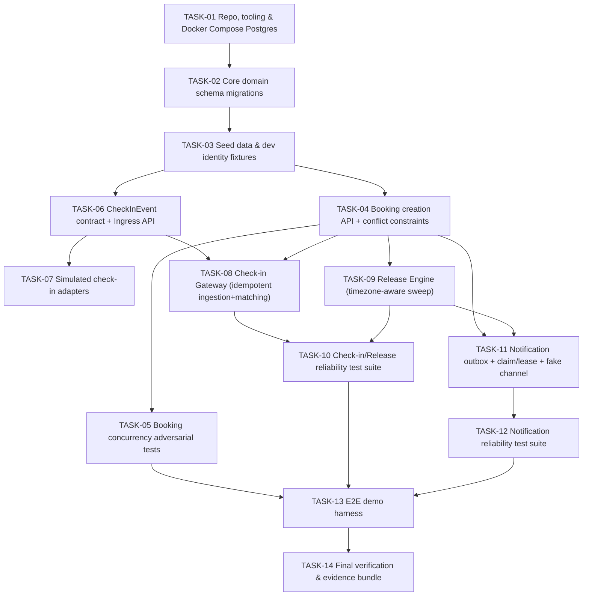

# Smart Office — Camp PoC Implementation Plan

Status: **APPROVED — READY FOR IMPLEMENTATION (Revision 3)**
Input basis: [`context/smart-office-context.md`](../context/smart-office-context.md) (APPROVED), [`design/smart-office-hld.md`](../design/smart-office-hld.md) (APPROVED, Revision 3), [`poc/smart-office-poc-selection.md`](../poc/smart-office-poc-selection.md) (APPROVED, Revision 1).
Produced by: `.claude/agents/poc-planner.md`, invoked via `.claude/commands/plan.md` on "poc tasks".
Scope: implementation planning only for the three functionalities selected in the PoC Selection document — **Booking Creation**, **Automatic Release of Unconfirmed Bookings**, **Notification Dispatch via Transactional Outbox**. This document does not implement code and does not change any HLD or PoC Selection decision.

### Revision history

**Revision 1** — initial draft, 41 tasks. Superseded — rejected on human review as too granular for a two-day Camp PoC.

**Revision 2** — consolidated to **14 delivery tasks**, grouping closely related work (schema/migrations, adapters, reliability tests, demo scripts) into single sessions of work, while preserving dependencies, bounded scope, acceptance criteria, verification evidence, and cross-implementer parallelisation. Two structural corrections were applied: (1) the Check-in Gateway depends only on the canonical `CheckInEvent` contract/queue (TASK-06), not on the concrete adapters (TASK-07); (2) the Audit Module is dropped as a standalone task — full-solution infrastructure (FR-13/14, BR-09) tied to manual overrides/admin reporting, neither of which is part of the three selected functionalities or the 11 required validation-coverage items.

**Revision 3** — final consistency corrections, approved for implementation: (1) tightened the TASK-09/TASK-11 boundary — TASK-09 performs only the release state transition; TASK-11 is solely responsible for extending that transaction to persist the `ReleaseNotice` notification intent; (2) corrected TASK-13's validation claim — it no longer claims all 11 validation items are exercised live, only that key items are demoed live while all 11 are backed by automated evidence (TASK-05/10/12); (3) removed `Policy.post_checkin_cancellation` from the PoC schema entirely, since no selected functionality or validation criterion uses it. No scope, task count, dependency, architecture, or stack change from Revision 2.

---

## 1. Implementation Assumptions and Decisions

| # | Decision | Why |
|---|---|---|
| 1 | Node.js + TypeScript, single language across API/worker/migrations/tests | Simplicity for a 2-day time-boxed PoC; types map onto HLD §4 domain model |
| 2 | Fastify for HTTP (internal API + public Check-in Ingress API) | TypeScript-first, built-in schema validation, needed at the Ingress boundary (§7.1) |
| 3 | PostgreSQL via Docker Compose only, no cloud/managed DB | HLD §12 mandates testing concurrency/idempotency "against a real database instance, never mocked" — local Postgres satisfies this with zero cloud dependency |
| 4 | pg-boss (Postgres-backed queue) standing in for the HLD's "Internal Managed Queue" | One infra dependency total; supports enqueue-in-same-transaction (needed for AD-04's outbox pattern and the release-sweep-then-enqueue flow); supports scheduled jobs and lease/visibility-timeout semantics (needed for the §5.5 crash-simulation window) |
| 5 | node-pg-migrate, plain SQL migrations, no ORM | The PoC's core guarantees are Postgres-specific constraint-level mechanisms (partial unique indexes, dedup unique constraints) that ORMs often can't express cleanly |
| 6 | Vitest + Supertest; integration tests run against the same Docker Compose Postgres as dev | Matches HLD §12's "real database instance" mandate exactly, zero dev/CI drift |
| 7 | Mocked identity: seeded `Employee` table + role_scope, dev-only bearer-token-to-employee mapping, no real Entra ID | C7 (Corporate Sign-in) not selected as a PoC functionality; still resolves `role_scope` server-side per request, preserving R-07 |
| 8 | Mocked `NotificationChannel`: fake Teams/Email implementation with test-controlled latency/failure injection | Real Graph integration explicitly out of scope for Functionality 3 |
| 9 | Two simulated check-in adapters: primary app/QR adapter (main demo path) + minimal second test-harness adapter (extensibility evidence only) | Required by PoC Selection §4 Functionality 2 to evidence FR-19, not merely assert it |
| 10 | `Clock` interface injected everywhere deadline logic runs; deterministic `FakeClock` in tests; short demo-scoped policy overrides for the live demo | Reproducible tests; live demo shows "no check-in → release" without a real wait |
| 11 | Two process entry points sharing one codebase: `api` and `worker` | Mirrors HLD §11's `ProdApp`/`ProdWorker` split; lets the crash-simulation dedup test kill/restart a real worker process mid-lease |
| 12 | **Check-in Gateway depends on the canonical `CheckInEvent` contract and the queue only — never imports or references a concrete adapter.** Adapters are upstream producers of canonical events; the Gateway is adapter-agnostic by construction, and its tests enqueue canonical `CheckInEvent` payloads directly rather than going through an adapter. | Human review correction; also the direct implementation of HLD AD-07 (canonical contract + adapter pattern, vendor-neutral core) and validation item 8 ("two adapters use the same contract without changing Booking-domain code") — coupling the Gateway to adapter code would undermine the very thing this functionality is supposed to prove |
| 13 | **Audit Module is not implemented in the PoC.** No `audit_record` table, no audit-write task. | FR-13/14/BR-09 (manual overrides, audit history) belong to Admin & Reporting (candidate C5), which the approved PoC Selection explicitly did **not** select; none of poc-planner.md's 11 required validation-coverage items or the PoC Selection §4 success criteria reference an audit trail — see §9 |
| 14 | **`Policy.post_checkin_cancellation` is omitted from the PoC schema entirely** (Revision 3). | HLD §4/N-05 leaves this policy value undecided; no selected PoC functionality or validation criterion exercises the `CheckedIn → Cancelled` transition — see §9 |

## 2. Proposed Repository / Module Structure

Module boundaries reuse HLD §3 terminology. The Admin & Reporting Module is intentionally omitted (not part of any selected functionality); there is no Audit Module (decision 13 above).

```
siliconskunk/
├── context/, design/, poc/           # existing, unchanged
├── planning/
│   ├── poc-implementation-plan.md    # this document
│   └── tasks/                        # TASK-01..TASK-14
├── docker-compose.yml                # Postgres only
├── .env.example
├── package.json, tsconfig.base.json
├── db/
│   ├── migrations/                   # node-pg-migrate — office, resource, policy, employee,
│   │                                  #   booking (+2 partial unique indexes), checkin_evidence,
│   │                                  #   external_mapping, notification. No audit_record.
│   └── seed/                         # offices.ts, resources.ts, policies.ts, employees.ts
├── src/
│   ├── shared/                       # clock/, db/, auth/, queue/, http/, logging/
│   ├── modules/
│   │   ├── office/
│   │   ├── resource-policy/
│   │   ├── booking/
│   │   ├── checkin-contract/          # canonical CheckInEvent type + schema (shared, no adapter deps)
│   │   ├── checkin-ingress/           # public API + adapters/app-qr.adapter.ts, test-harness.adapter.ts
│   │   ├── checkin-gateway/           # depends only on checkin-contract + queue, never on adapters/
│   │   ├── release-engine/
│   │   └── notification/              # + channels/fake-notification.channel.ts
│   ├── api/server.ts                  # entry point
│   └── worker/worker.ts               # entry point
├── test/
│   ├── unit/, integration/{booking-concurrency,checkin-release,notification-outbox}/
│   ├── contract/, e2e/demo-story.spec.ts
└── scripts/
    ├── demo/                          # happy-path.ts + adversarial-*.ts scripts
    └── dev/                           # docker up / migrate / seed convenience scripts
```

No `audit/` module. If reviewers later decide auditability must be demoed, that is a scope addition to be raised as a new human decision (§9), not silently added.

## 3. Dependency Diagram (task level)



Note T07 has no arrow into T08 — adapters and the Gateway are parallel branches off the shared contract (TASK-06), per decision §1.12.

## 4. Ordered Task Backlog

| ID | Title | Purpose | Depends on | Group |
|---|---|---|---|---|
| TASK-01 | Repo, tooling & Docker Compose Postgres foundation | Scaffold TS workspace, lint/format, Docker Compose Postgres, `pg` pool + tx helper, migration CLI wiring | — | Foundation |
| TASK-02 | Core domain schema migrations | All migrations in one pass: Office, Resource, Policy, Employee, Booking (+ both partial unique indexes for conflict prevention), CheckinEvidence (+ idempotency unique constraint), ExternalMapping, Notification outbox (+ dedup unique constraint). No audit table. | TASK-01 | Foundation |
| TASK-03 | Seed data & dev identity fixtures | Seed 2 offices/timezones, resources (desks+parking), policies (incl. short demo-override deadline), employees + seeded dev bearer tokens across role_scopes | TASK-02 | Foundation |
| TASK-04 | Booking creation API + conflict-prevention constraints | Availability search, `POST /bookings`, BR-01/03/04 server-side enforcement, 409 mapping for both resource-level and employee-level constraint violations | TASK-03 | Track A |
| TASK-05 | Booking concurrency adversarial test suite | Integration tests firing simultaneous conflicting requests (same resource; same employee/different resources) against the real DB, exactly one success/one clean 409 each, repeated N times | TASK-04 | Track A |
| TASK-06 | Canonical `CheckInEvent` contract + Check-in Ingress API | Shared contract type/schema (HLD §7.1); public per-adapter-auth Ingress endpoint that validates, translates, enqueues, returns 202 | TASK-03 | Track B |
| TASK-07 | Simulated check-in adapters (app/QR + test-harness) | Two adapters translating distinct provider payload shapes into the canonical contract via the Ingress boundary from TASK-06; contract tests proving each independently of the Booking domain | TASK-06 | Track B |
| TASK-08 | Check-in Gateway worker (idempotent ingestion + matching) | Consume canonical events from the queue (contract-only dependency, no adapter import); idempotent insert via `(source_system, external_event_id)`; resolve External Mapping; match to `Reserved` booking or record `Unmatched` | TASK-04, TASK-06 | Track B |
| TASK-09 | Release Engine (timezone-aware sweep) | Deadline-computation utility (local time → UTC instant, IANA tz, incl. a DST case) + scheduled idempotent conditional-`UPDATE` sweep worker, per-office | TASK-04 | Track B |
| TASK-10 | Check-in/Release reliability test suite | Integration tests: duplicate check-in delivered twice → one effect; sweep run twice → no double-release; late check-in after release → stays `Released`, evidence `Unmatched`, never restored (BR-08); released resource reappears in TASK-04's availability search | TASK-08, TASK-09 | Track B |
| TASK-11 | Notification outbox, claim/lease worker & mocked channel | Outbox producer wiring (Confirmation intent on booking create, ReleaseNotice intent on sweep, same transaction as the triggering write); claim/lease worker (`Pending→Sending→Sent`, lease-expiry reclaim); fake `NotificationChannel` with latency/failure injection | TASK-04, TASK-09 | Track C |
| TASK-12 | Notification reliability test suite | Integration tests: failing channel never blocks/fails the triggering booking/release transaction; crash-simulation between provider-ack and status commit confines the duplicate to the one documented window; full lifecycle produces exactly one intent per event | TASK-11 | Track C |
| TASK-13 | End-to-end demo harness | One happy-path script/test (Discover→Reserve→Confirm→No-checkin→Release→Re-offer) + four adversarial demo scripts (concurrent race, duplicate check-in, late check-in, notification failure) + adapter-extensibility evidence packaging, all reusing the already-proven functionality from TASK-05/10/12 | TASK-05, TASK-10, TASK-12 | Demo |
| TASK-14 | Final full-suite verification & evidence bundle | Run the entire automated suite + all demo scripts non-interactively; produce one consolidated evidence checklist mapped to §6/§7 | TASK-13 | Demo |

## 5. Parallelisation Opportunities

After **TASK-01→02→03** (Foundation, strictly sequential, forms the floor for everything else), work splits into independent streams:

- **Stream 1 — Track A (TASK-04 → TASK-05).** Fully independent once Foundation lands.
- **Stream 2 — Track B contract/ingestion side (TASK-06 → TASK-07), in parallel with Track A.** Needs only Foundation's schema, not a booking. TASK-07 (adapters) can be built by a second implementer the moment TASK-06 lands, entirely independent of Track A.
- **Stream 3 — Track B matching/release side (TASK-08, TASK-09), starting once TASK-04 lands.** TASK-08 needs TASK-06 (contract) + TASK-04 (a `Reserved` booking to match against) — **not** TASK-07; it can proceed in parallel with TASK-07. TASK-09 needs only TASK-04. TASK-08 and TASK-09 can run in parallel with each other.
- **Stream 4 — Track C mechanism (TASK-11), starting once TASK-04 and TASK-09 land** (it needs both event sources for producer wiring). The claim/lease worker and fake channel *internals* have no dependency beyond TASK-03's schema and could be scaffolded earlier by a third implementer working ahead, but the task as scoped (including producer wiring) completes only after TASK-04/TASK-09.
- **TASK-10** joins TASK-08+TASK-09. **TASK-12** follows TASK-11. **TASK-13** joins TASK-05+TASK-10+TASK-12. **TASK-14** is the final sequential step.

**Suggested grouping for 2–3 implementers over ~2 days:**
- Implementer 1: Foundation (pairs on TASK-01–03) → TASK-04 → TASK-05 → contributes to TASK-13.
- Implementer 2: Foundation → TASK-06 → TASK-07 (parallel to Implementer 1's TASK-04/05) → TASK-08 (once TASK-04 lands) → contributes to TASK-10/13.
- Implementer 3: Foundation → TASK-09 (once TASK-04 lands, parallel to Implementer 2's TASK-08) → TASK-11 → TASK-12 → contributes to TASK-13.
- Whoever finishes first: TASK-14.

## 6. Requirement / Validation Traceability

**poc-planner.md's 11 required validation items:**

| # | Item | Tasks |
|---|---|---|
| 1 | Booking creation works | TASK-04, TASK-13 |
| 2 | No double-booking same resource under concurrency | TASK-04, TASK-05, TASK-13 |
| 3 | No double-booking same employee/type/day under concurrency | TASK-04, TASK-05, TASK-13 |
| 4 | Unconfirmed bookings auto-released | TASK-09, TASK-10, TASK-13 |
| 5 | Duplicate check-in events idempotent | TASK-06, TASK-08, TASK-10, TASK-13 |
| 6 | Late check-in after release doesn't restore booking | TASK-08, TASK-10, TASK-13 |
| 7 | Released resources become available again | TASK-04, TASK-09, TASK-10, TASK-13 |
| 8 | Two adapters, same contract, no Booking-domain changes | TASK-06, TASK-07, TASK-13 |
| 9 | Exactly one notification intent per lifecycle event | TASK-11, TASK-12 |
| 10 | Notification failure doesn't affect booking/release correctness | TASK-11, TASK-12, TASK-13 |
| 11 | Documented at-least-once notification behaviour preserved | TASK-11, TASK-12, TASK-14 |

**PoC Selection §4 functionality → FR/BR traceability:**

| Functionality | Requirement | Tasks |
|---|---|---|
| 1 — Booking Creation | FR-03, FR-01 (scaffolding), FR-05/R-01, BR-02, BR-01/03/04 | TASK-04, TASK-05 |
| 2 — Automatic Release | FR-09, FR-08 (scaffolding), R-02/03/04/05, BR-05/06/07/08, FR-10, FR-19/R-09 | TASK-06–TASK-10, TASK-13 |
| 3 — Notification Dispatch | FR-18 | TASK-11, TASK-12 |

## 7. Verification and Evidence Matrix

| Demo track | Evidence artifact | Producing tasks |
|---|---|---|
| Booking conflict prevention | Repeated concurrent-race integration test vs. real DB, exactly one 201 / one 409 per case | TASK-05 (test), TASK-13 (live demo) |
| Check-in/release idempotency | Duplicate-delivery test, sweep-run-twice test, late-checkin-unmatched test, availability-refresh test | TASK-10 (tests), TASK-13 (demo) |
| Notification dedup | Failure-isolation test, crash-simulation dedup test, exactly-one-intent test | TASK-12 (tests), TASK-13 (demo) |
| End-to-end demo story | Full narrative e2e test + consolidated full-suite run | TASK-13 (test), TASK-14 (final run + evidence checklist) |

## 8. End-to-end Demo Execution Plan

**Step 1 — Happy path (TASK-13):** search availability → book a desk (confirmation notification enqueued/sent immediately, decoupled from the booking transaction) → do **not** check in → let the demo-scoped short deadline pass → sweep fires, booking → `Released`, release-notice sent → re-run availability search, the desk reappears free → show both notification intents `Sent` in the fake channel's log.

**Step 2 — Adversarial demonstrations (TASK-13):** concurrent race (two simultaneous booking requests, same resource and same-employee/different-resource cases, one 201/one 409 live); duplicate check-in (same payload sent twice through the app/QR adapter, one evidence row, no error on redelivery); late check-in after release (booking stays `Released`, evidence `Unmatched`, never silently applied); notification provider failure (fake channel set to fail, booking still succeeds, outbox retries with backoff, booking transaction never blocked).

**Step 3 — Adapter extensibility evidence (non-centrepiece, TASK-13):** show the second adapter (TASK-07) registered as an additional Ingress route only, pointing at TASK-07's contract-test output and TASK-08's adapter-agnostic dependency (§1.12) as evidence no Booking-domain or Gateway code changed to add it.

**Step 4 — Final verification (TASK-14):** run the full automated suite plus all demo scenarios end-to-end, non-interactively, collect the evidence bundle against §6/§7.

## 9. Risks, Blockers, and Human Decisions Required

| # | Item | Type | Blocking? |
|---|---|---|---|
| 1 | Demo modality: scripted CLI/API harness vs. a minimal web UI | Human decision | No — proceeding with a CLI/scripted harness per PoC Selection's UI exclusion; flagged for confirmation before TASK-13 starts, not before Foundation |
| 2 | Audit Module omitted entirely from PoC scope | Explicit scope decision | No — not required by any selected functionality or validation-coverage item (§1.13); if a reviewer wants auditability demoed, that is new scope requiring a fresh decision, not something to silently add back |
| 3 | Check-in Gateway is adapter-agnostic by construction (depends only on TASK-06's contract) | Explicit design correction | No — enables TASK-07/TASK-08 parallelism and is the direct proof of validation item 8 |
| 4 | Two adapters, mocked identity/Graph | Already resolved by the human | No |
| 5 | `Policy.post_checkin_cancellation` (HLD N-05, open) | Omitted from the PoC schema entirely (Revision 3), not just unimplemented — no selected functionality or validation criterion uses it; the HLD's open policy decision itself is untouched, this is a PoC-scope simplification | No |
| 6 | Release-sweep and notification-dispatch poll intervals; exact outbox lease-column shape | Implementation-level detail (HLD N-04 leaves this open) | No |
| 7 | Two offices/timezones for seed data | Implementation-level seed choice, folds in PoC-Q-03 | No |
| 8 | No CI/CD, no SAST, no cloud deployment for the PoC | Explicitly out of scope per C-01 and the fixed stack decisions | No |
| 9 | No admin console, no view/cancel UI, no audit reporting UI | Out of scope per PoC Selection §2 (C4/C5 verdicts) | No |

No item blocks starting Foundation (TASK-01–03). Item 1 should be confirmed before TASK-13 begins.

## 10. Ready-for-Implementation Assessment

Every selected PoC functionality is covered (Booking Creation: TASK-04/05; Automatic Release via two adapters: TASK-06–10; Notification Dispatch: TASK-11/12). Every item in poc-planner.md's 11-point Required Validation Coverage and every FR/BR traced in PoC Selection §4 maps to at least one task (§6). All 14 tasks are independently understandable, dependency-ordered (§3/§4), and bounded to one coherent unit of delivery work sized for a single implementation/review session — no task is a vague catch-all, and none is sub-atomic (one migration, one test case). Acceptance criteria in each task file are observable/testable. No approved HLD or PoC Selection scope has been changed; the Audit-omission, Gateway-decoupling, and Revision 3 corrections are implementation-level clarifications, not scope changes, and are explicitly logged in §9 rather than silently applied. One non-blocking item (demo modality) is flagged for confirmation before TASK-13.

**Verdict: APPROVED — READY FOR IMPLEMENTATION**

Per `.claude/agents/poc-planner.md`, this agent's lifecycle ends here. No implementation begins automatically; no further lifecycle stage is invoked.
